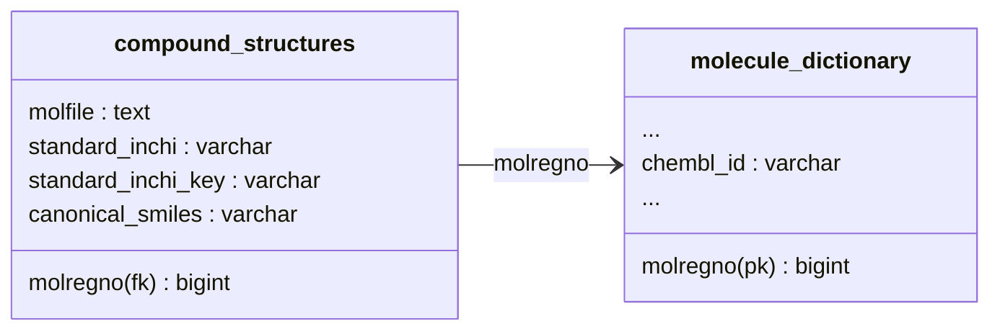

{{ page.description }}

## ChEMBL에서 RDKit 분자 객체 추출

[ChEMBL](https://www.ebi.ac.uk/chembl/)은 약물과 유사한 특성을 가진 생리활성 분자의 화학 데이터베이스입니다.
많은 연구자들의 노력으로 손수 큐레이팅된 이 분자 데이터베이스는 다양한 포멧의 덤프 파일이 온라인에 공개되어 있습니다.
이 중 sqlite 포멧을 다운로드하고 데이터베이스를 열어 테이블을 확인해 봅시다.

```python
import wget
import tarfile
import sqlite3
import pandas as pd

fileurl = 'https://ftp.ebi.ac.uk/pub/databases/chembl/ChEMBLdb/latest/chembl_30_sqlite.tar.gz'
wget.download(fileurl)
with tarfile.open('chembl_30_sqlite.tar.gz') as chembl:
    dbfile = chembl.extractfile('chembl_30/chembl_30_sqlite/chembl_30.db')
    # chembl_30/chembl_30_sqlite/chembl_30.db -> chembl_30.db
    with open('chembl_30.db', 'wb') as f:
        f.write(dbfile.read())

chembldb = sqlite3.connect('chembl_30.db')
tablecount = [
    (table, count)
    for table, in chembldb.execute("SELECT name FROM sqlite_master WHERE type='table'").fetchall()
    for count, in chembldb.execute(f"SELECT COUNT(*) FROM {table}").fetchall()
]

aspddf = pd.DataFrame(tablecount, columns=['table', 'count'])
print(aspddf.sort_values(by='count', ascending=False).reset_index(drop=True))
chembldb.close()

```

|       | table                      | count       |
|-------|----------------------------|-------------|
| 0     | activities                 | 19286751    |
| 1     | activity_properties        | 7424248     |
| 2     | chembl_id_lookup           | 4131045     |
| 3     | compound_structural_alerts | 4112274     |
| 4     | compound_records           | 2786911     |
| **5** | **molecule_dictionary**    | **2157379** |
| 6     | compound_properties        | 2139763     |
| **7** | **compound_structures**    | **2136187** |
| 8     | molecule_hierarchy         | 2073423     |
| 9     | ...                        | ...         |
| 78    | curation_lookup            | 3           |
| 79    | version                    | 1           |

ChEMBL의 30 version 데이터베이스는 80개의 테이블로 자세한 분자 정보를 제공하고 있습니다.
이 문서에서는 분자 유사도 계산을 위해 **compound_structures**와 **molecule_dictionary** 테이블을 다루겠습니다.
**compound_structures**는 분자 객체 `molfile`, **molecule_dictionary**는 분자 식별자 `chembl_id`를 담고 있으며
두 테이블은 `molregno` key로 연결되어 있습니다.


<br/>
이제 이 두 테이블을 `molregno`로 join 하고 (`chembl_id`, `molfile`) 쌍의 값을 하나 확인해 보겠습니다.

```python
chembldb = sqlite3.connect('chembl_30.db')
for chemblid, molfile in chembldb.execute("""
    SELECT molecule_dictionary.chembl_id, compound_structures.molfile
    FROM molecule_dictionary, compound_structures
    WHERE molecule_dictionary.molregno = compound_structures.molregno
"""):
    print(chemblid, molfile)
    break
chembldb.close()
```

```
CHEMBL6329
     RDKit          2D
24 26  0  0  0  0  0  0  0  0999 V2000
    5.2792   -2.0500    0.0000 C   0  0  0  0  0  0  0  0  0  0  0  0
    5.7917   -2.3500    0.0000 N   0  0  0  0  0  0  0  0  0  0  0  0
    ...
    7.3417   -5.6417    0.0000 C   0  0  0  0  0  0  0  0  0  0  0  0
  2  1  1  0
  3  1  1  0
...
22 24  2  0
M  END
```

위 출력된 결과에서 **`chembl_id`**는 `CHEMBLXXXX` 형태의 문자열로, 간단히 `molfile`의 식별자로 활용하겠습니다.
그리고 **`molfile`**은 `RDKit` ~ `END` 사이 공백과 개행이 포함된 문자열로,
[**Mol file 형식**](https://chem.libretexts.org/Courses/University_of_Arkansas_Little_Rock/ChemInformatics_(2017)%3A_Chem_4399_5399/2.2%3A_Chemical_Representations_on_Computer%3A_Part_II/2.2.2%3A_Anatomy_of_a_MOL_file)의 분자 표현입니다.

`molfile`의 첫번째 라인 `RDKit 2D` 에 보이는 [RDKit](https://www.rdkit.org/)은 화학정보학 분야에서 널리 사용되는 분자 분석용 Python 라이브러리입니다.
사실 `compound_structures.molfile` 값은 *RDKit의 분자 객체*를 **Mol file 형식**으로 덤프한 것입니다.
그리고 이 덤프된 문자열로 다시 *RDKit의 분자 객체*, `rdkit.Chem.rdchem.Mol`의 인스턴스를 복원할 수 있습니다.
```python
from rdkit import Chem
molecule: Chem.rdchem.Mol = Chem.MolFromMolBlock(molfile)
```

지금까지 ChEMBL 데이터베이스로부터 *RDKit 분자 객체*를 얻는 과정을 간략히 살펴 보았습니다.
이제 RDKit의 도움을 받아 RDKit 분자 객체들 사이의 *유사도*를 계산해 보겠습니다.

## Molecular Fingerprinting과 Similarity
분자의 **구조 정보**를 bit의 배열로 표현하는 방법을 *Molecular fingerprinting* 이라고 합니다.
그리고 Molecular fingerprint 간의 유사도가 *Molecular similarity* 입니다.
즉, *Molecular similarity* 란 Molecular fingerprint 간의 유사도를 뜻하며, 두 분자가 구조적으로 유사한 정도로 해석됩니다.
분자의 특성은 분자의 구조에 기인하므로, 두 분자의 Molecular fingerprint가 유사하다면 분자 특성도 유사할 것이라고 추측할 수 있습니다.

RDKit은 Molecular fingerprint를 생성하고 이들간 Molecular similarity를 계산하는, 현재까지 연구되고 있는 다양한 방법들을 함수로 제공하고 있습니다.
그 중 [RDKit 문서의 Fingerprinting and Molecular Similarity 섹션](https://www.rdkit.org/docs/GettingStartedInPython.html#fingerprinting-and-molecular-similarity)
을 참고하여 가장 간단한 방법을 사용하는 예제를 작성해 보겠습니다.

```python
from rdkit import Chem, DataStructs

# Step 0. Prepare a pair of molfiles
chembldb = sqlite3.connect('chembl_30.db')
(chemblid1, molfile1), (chemblid2, molfile2) = chembldb.execute("""
    SELECT molecule_dictionary.chembl_id, compound_structures.molfile
    FROM molecule_dictionary, compound_structures
    WHERE molecule_dictionary.molregno = compound_structures.molregno
    LIMIT 2
""").fetchall()
chembldb.close()

# Step 1. Get the `Mol` objects
molobj1, molobj2 = [Chem.MolFromMolBlock(m) for m in (molfile1, molfile2)]

# Step 2. Translate them to fingerprints
fingerprint1, fingerprint2 = [Chem.RDKFingerprint(m) for m in (molobj1, molobj2)]

# Step 3. Calculate molecular similarity using the fingerprints
molsim = DataStructs.FingerprintSimilarity(fingerprint1, fingerprint2)

print(chemblid1, chemblid2, molsim)  # CHEMBL6329 CHEMBL6328 0.8778280542986425
```

`Step 2`의 `rdkit.Chem.RDKFingerprint`는 `rdkit.Chem.rdchem.Mol` 객체의 fingerprint를 구하는 함수로,
알고리즘이 [RDKit Fingerprints](https://www.rdkit.org/docs/RDKit_Book.html#rdkit-fingerprints)에 소개되어 있습니다.
이 함수의 반환값 fingerprint 변수의 구조는 2048개 bit의 배열입니다.
```
>>> type(fingerprint1)
rdkit.DataStructs.cDataStructs.ExplicitBitVect
>>> fingerprint1.GetNumBits()
2048
>>> fingerprint1.ToBitString()
'1110011100...
```

그리고 `Step 3`의 `rdkit.DataStructs.FingerprintSimilarity`는 두 fingerprint간의 similariry를 0과 1 사이의 값으로 반환합니다.
그런데 이 함수의 `metric` 인수를 명시하지 않을 경우, 기본값 `rdkit.DataStructs.TanimotoSimilarity` 가 similariry 계산에 사용되는데
Tanimoto similarity 계산식은 이전 게시물에서 살펴본 Jaccard score와 동일합니다.

$$
Tanimoto(A, B) = {| A \cup B | \over | A \cap B |}
$$

지금까지 분자 유사도 계산에 필요한 RDKit 함수를 간략히 소개하였습니다.
이를 바탕으로 임의의 ChEMBL ID를 한 쌍 입력받아 유사도를 반환하는 함수를 작성한다면 대략적인 구조는 다음과 같은 형태가 될 것입니다.
```python
def chembl_similarity(chembl1: str, chembl2: str) -> float:
    chembldb = sqlite3.connect('chembl_30.db')
    molfiles = chembldb.execute(f"""
        SELECT compound_structures.molfile FROM molecule_dictionary, compound_structures
        WHERE
        molecule_dictionary.molregno = compound_structures.molregno AND
        molecule_dictionary.chembl_id IN ('{chembl1}', '{chembl2}')
    """)
    fingerprints = [Chem.RDKFingerprint(Chem.MolFromMolBlock(m)) for m, in molfiles]
    chembldb.close()

    assert len(fingerprints) == 2
    return DataStructs.FingerprintSimilarity(*fingerprints)
```

## ChEMBL Similarity Search

이론적인 분자 유사도 개념에 기반한 좀 더 실질적인 응용 사례는 _분자 유사도 검색 (Molecular similarity search)_ 입니다.
분자 유사도 검색이란 분자 하나를 입력받아 전체 데이터베이스에서 해당 분자와 특정값 이상의 유사도를 가지는 분자를 모두 찾는 것입니다.
지금부터 ChEMBL 데이터베이스의 전체 분자들을 대상으로 이 동작을 구현해 봅시다.

```python
from typing import Iterable
from tqdm import tqdm

def similar_chembls(querychembl: str, threshold: float) -> Iterable[str]:
    """`chemblquery`와 `threshold` 이상의 유사도를 가지는 ChEMBL 분자 검색.

    :param querychembl: ChEMBL 데이터베이스에서 분자의 identifier
    :param threshold: 0.0 ~ 1.0 사이의 유사도 lower bound
    :return: 순회 가능한 ChEMBL identifier 문자열
    """
    # Step 1. Fingerprints Cache 준비
    chembldb = sqlite3.connect('chembl_30.db')
    fpcache = dict()
    for chemblid, molfile in tqdm(chembldb.execute(f"""
        SELECT molecule_dictionary.chembl_id, compound_structures.molfile
        FROM molecule_dictionary, compound_structures
        WHERE molecule_dictionary.molregno = compound_structures.molregno
    """)):
        fpcache[chemblid] = Chem.RDKFingerprint(Chem.MolFromMolBlock(molfile))
    chembldb.close()
    # Step 2. Filtering 처리
    queryfp = fpcache[querychembl]
    return (
        chembl for chembl, fp in fpcache.items()
        if DataStructs.FingerprintSimilarity(queryfp, fp) >= threshold and chembl != querychembl
    )
```

분자 유사도 검색 함수 `similar_chembls`의 구현은 크게 Fingerprints cache를 준비하고, Threshold filtering을 처리하는 두 부분으로 나누어집니다.
이 구현은 직관적으로 이해가 쉽지만 성능에 문제가 있습니다. 각 `Step`의 시간 복잡도는 $$O(n)$$ 으로 비교적 온건한 수준이지만,
200만개 이상의 ChEMBL 분자에 대한 `MolFromMolBlock`, `RDKFingerprint`, `FingerprintSimilarity` 의 선형 처리가 완료 시간을 크게 지연시킵니다.
특히 반복적인 `similar_chembls` 호출을 고려하여 `Step 1`의 `fpcache`는 이름처럼 Cache 될 필요가 있습니다.
이와 같은 성능 문제를 개선하기 위해 먼저 Cache 파일을 준비해 보겠습니다.

```python
from pathlib import Path
import multiprocessing as mp

def make_cache():
    cachefile: Path = Path('chembl_30_fps.npz')

    # Step 1. Define and start parallel processing functions.
    def translate_fp(q_mf, q_fp):
        while True:
            mf = q_mf.get()
            if mf:
                id, mf = mf
                fp = Chem.RDKFingerprint(Chem.MolFromMolBlock(mf))
                fp = np.array([bit == '1' for bit in fp.ToBitString()])
                q_fp.put((id, fp))
            else:
                return

    queue_mf = mp.Queue()
    queue_fp = mp.Queue()
    procnum = 48
    procs = [mp.Process(target=translate_fp, args=(queue_mf, queue_fp)) for _ in range(procnum)]
    [proc.start() for proc in procs]

    # Step 2. Inject the parallel processing data into the queue.
    query = f"""
        SELECT molecule_dictionary.chembl_id, compound_structures.molfile
        FROM molecule_dictionary, compound_structures
        WHERE molecule_dictionary.molregno = compound_structures.molregno
    """

    chembldb, total = sqlite3.connect('chembl_30.db'), 0
    for i, (chemblid, molfile) in tqdm(enumerate(chembldb.execute(query))):
        queue_mf.put((chemblid, molfile))
        total = i + 1
    chembldb.close()

    # Step 3. Gather all the parallel processed data from the queue.
    fpcache = []
    for _ in tqdm(range(total)):
        fpcache.append(queue_fp.get())
    [queue_mf.put(None) for _ in range(procnum)]
    [proc.join() for proc in procs]

    # Step 4. Dump results to the cache file.
    chemblids, fps = list(zip(*fpcache))
    chemblids, fps = np.array(chemblids), np.array(fps)
    np.savez(cachefile, chemblids=chemblids, fps=fps)
```

위 코드에서 Cache 생성 시간을 단축시키기 위해 Python `multiprocessing` 패키지의 병렬 처리를 적용하였습니다.
그리고 Cache 데이터를 npz 파일로 덤프하기 위해 Fingerprint로 `np.ndarray` 형식이 사용된 점도 참고해 주세요.
이제 이 Cache 파일을 활용하는 분자 유사도 검색부를 작성해 보겠습니다.

```python
from sklearn.metrics import jaccard_score

def similar_chembls_new(querychembl: str, threshold: float) -> Iterable[str]:
    cachefile: Path = Path('chembl_30_fps.npz')
    # Shared variables among child processes via the Copy-On-Write trick.
    with np.load(cachefile) as cachedata:
        chemblids = cachedata['chemblids']
        fps = cachedata['fps']
    chemblid_to_index = {chemblid: i for i, chemblid in enumerate(chemblids)}
    querychembl_index = chemblid_to_index[querychembl]
    querychembl_fp = fps[querychembl_index]

    def similariry_proc(q_inp, q_out):
        while True:
            index: int = q_inp.get()
            if index is not None:
                similarity = jaccard_score(querychembl_fp, fps[index])
                q_out.put((index, similarity))
            else:
                return

    queue_input = mp.Queue()
    queue_output = mp.Queue()
    procnum = 48
    procs = [mp.Process(target=similariry_proc, args=(queue_input, queue_output)) for _ in range(procnum)]
    [proc.start() for proc in procs]
    for i in tqdm(range(len(chemblids))):
        queue_input.put(i)

    for _ in tqdm(range(len(chemblids))):
        idx, sim = queue_output.get()
        if sim >= threshold and idx != querychembl_index:  # Skip the self-comparing similarity
            yield chemblids[idx]

    [queue_input.put(None) for _ in range(procnum)]
    [proc.join() for proc in procs]
```

`similar_chembls_new`에서는 `make_cache`와 유사한 병렬 처리 기법이 적용되었습니다.
두 함수 모두 자식 프로세스들과 input/output 역할을 담당하는 `mp.Queue`를 통해 데이터를 송수신하며
부모 프로세스는 `None` 값을 신호로 자식 프로세스들을 종료시킵니다.

`similar_chembls_new`에서 좀 더 설명 드릴 부분이 두 가지 있습니다. <br>
　첫째, `querychembl_fp`, `fps` 변수가 부모/자식 프로세스들 간 공유됩니다.
이 기법은 POSIX 규격의 `fork()` 구현에 명세된 _Copy-On-Write (COW)_ 를 활용한 것입니다.
일반적으로 *Inter-Process-Communication (IPC)* 에서는 데이터를 직렬화하고 전송하는데 큰 오버헤드가 있습니다.
따라서 자식 프로세스 `similariry_proc`들이 Fingerprint 전체 배열이 아니라 상대적으로 용량이 작은 `fps`의 index를 전달받도록 하여 IPC 오버헤드를 최소화하였습니다. <br>
　둘째, 유사도 계산 시 RDKit `FingerprintSimilarity` 대신 scikit-learn의 `jaccard_score`를 사용하였습니다.
표면적인 이유는 `cachefile`에 저장된 데이터가 Fingerprint의 `ExplicitBitVect` 객체가 아니라 1차원 `np.ndarray` 이기 때문이지만,
사실 Fingerprint에 `np.ndarray` 형식을 사용한 것은
<U>Bit array 포멧의 Fingerprint</U>, <U>Tanimoto similarity와 동일한 Jaccard score</U>, <U>Jaccard score의 병렬 처리</U>를
준비하여 [GPU 가속](/posts/Numba로-Pairwise-Jaccard-score-계산-가속/)을 의도한 것입니다.

지금은 이 문서 _RDKit을 활용한 ChEMBL 분자들 사이의 유사도 검색_ 에서 다루는 주제의 범위를 고려하여
COW 활용, GPU 가속 관련 내용은 근시일 내 별도의 게시물에서 자세히 소개해 드리도록 하겠습니다.

## Usage of Similarity Search Class

지금까지 `chembl_similarity`, `similar_chembls`, `make_cache`, `similar_chembls_new` 를 통해
ChEMBL Similarity Search 기능을 구현할 때 필요한 내용들을 모두 다루었습니다.
아래 코드는 이 함수들의 구현을 이어 붙여 만든 가장 간단한 버전의 ChEMBL Similarity Search class의 예제로 참고 부탁 드립니다.

```python

import multiprocessing as mp
import sqlite3
from pathlib import Path
from typing import Iterable
import numpy as np
from rdkit import Chem
from sklearn.metrics import jaccard_score
from tqdm import tqdm

class ChemblSimilaritySearch(object):

    def __init__(self):
        # Step 1. Fingerprints Cache 준비
        cachefile = Path('chembl_30_fps.npz')
        if not cachefile.exists():
            chemblsqlite = Path('chembl_30.db')

            def procfp(q_mf, q_fp):
                while True:
                    mf = q_mf.get()
                    if mf:
                        id, mf = mf
                        fp = Chem.RDKFingerprint(Chem.MolFromMolBlock(mf))
                        fp = np.array([bit == '1' for bit in fp.ToBitString()])
                        q_fp.put((id, fp))
                    else:
                        return

            queue_mf = mp.Queue()
            queue_fp = mp.Queue()
            procnum = 48
            procs = [mp.Process(target=procfp, args=(queue_mf, queue_fp)) for _ in range(procnum)]
            [proc.start() for proc in procs]

            query = f"""
                SELECT molecule_dictionary.chembl_id, compound_structures.molfile
                FROM molecule_dictionary, compound_structures
                WHERE molecule_dictionary.molregno = compound_structures.molregno
            """

            chembldb, total = sqlite3.connect(chemblsqlite), 0
            for i, (chemblid, molfile) in tqdm(enumerate(chembldb.execute(query))):
                queue_mf.put((chemblid, molfile))
                total = i + 1
            chembldb.close()

            fpcache = []
            for _ in tqdm(range(total)):
                fpcache.append(queue_fp.get())
            [queue_mf.put(None) for _ in range(procnum)]
            [proc.join() for proc in procs]

            chemblids, fps = list(zip(*fpcache))
            chemblids, fps = np.array(chemblids), np.array(fps)
            np.savez(cachefile, chemblids=chemblids, fps=fps)

        with np.load(cachefile) as cachedata:
            self.chemblids = cachedata['chemblids']
            self.fps = cachedata['fps']
        self.chemblid_to_index = {chemblid: i for i, chemblid in enumerate(self.chemblids)}

    def __call__(self, querychembl: str, threshold: float) -> Iterable[str]:
        # Step 2. Filtering 처리
        querychembl_index = self.chemblid_to_index[querychembl]
        querychembl_fp = self.fps[querychembl_index]

        def procsim(q_inp, q_out):
            while True:
                index: int = q_inp.get()
                if index is not None:
                    similarity = jaccard_score(querychembl_fp, self.fps[index])
                    q_out.put((index, similarity))
                else:
                    return

        queue_input = mp.Queue()
        queue_output = mp.Queue()
        procnum = 48
        procs = [mp.Process(target=procsim, args=(queue_input, queue_output)) for _ in range(procnum)]
        [proc.start() for proc in procs]
        for i in range(len(self.chemblids)):
            queue_input.put(i)

        for _ in tqdm(range(len(self.chemblids))):
            idx, sim = queue_output.get()
            if sim >= threshold and idx != querychembl_index:
                yield self.chemblids[idx]

        [queue_input.put(None) for _ in range(procnum)]
        [proc.join() for proc in procs]

# 객체 생성하여 cache를 메모리에 적재
chembl_similarity_search = ChemblSimilaritySearch()
# 유사도 검색 사용 예
for chemblid in chembl_similarity_search('CHEMBL6329', 0.9):
    print(chemblid)
```

## 여담과 요약

이 문서에는 화학정보학 분야의 논쟁적인 이슈가 포함되어 있습니다.
많은 경우 분자의 2D 구조에 대한 유사도로 분자 특성을 예측하는 것이 타당하지 않으며, 분자 유사도 계산식으로 Tanimoto similarity는 너무 단순합니다.
따라서 이 문서에서 다룬 분자 유사도 검색 방법이 그 학술적 의미를 대표하지 않음을 밝힙니다.
다만 이 문서에서는 데이터 확보와 변환, 처리 속도 개선과 같은 아래의 프로그래밍 주제로 문맥을 전개하는데 해당 문제점들을 그대로 사용하였습니다.
- `RDKit`을 사용하여 ChEMBL 데이터베이스의 RDKit 2D molfile 값으로 Fingerprint 추출
- Bit array 덤프 활용을 위해 Tanimoto similarity와 동일한 sklearn의 `jaccard_score` 사용

`multiprocessing`은 병렬 처리를 위한 Python 내장 패키지로, 지금까지 살펴본 예제의
*Bit array 덤프*와 *유사도 검색* 에서 여러 개의 자식 프로세스에 *연산-집약적(CPU-bound)* 동작을 위임하는데 활용되었습니다.
이 때 부모 프로세스는 IPC 채널, `multiprocessing.Queue` 를 통해 처리할 데이터를 주입하고 처리된 데이터를 수집합니다.
IPC는 데이터를 직렬화하고 전송하는데 오버헤드가 있어, Read-only 데이터에 COW를 활용하여 오버헤드를 경감시키는 방법도 살펴보았습니다.

마지막으로 ChEMBL Similarity Search 기능을 담당하는 `ChemblSimilaritySearch` class를 작성하였습니다.
이 class는 ChEMBL 전체 검색에 5분 이내의 시간이 소요됩니다.
선형 처리에 비해 분명한 성능 개선이 있지만 웹서비스와 같은 실시간 응용을 고려하면 처리 시간을 더 단축시킬 필요가 있겠습니다.
사실 예제를 제외한다면 이 문서의 주제는 **'CPU 병렬 처리'**라고 할 수 있습니다.
곧 새로운 게시물에서 **'GPU 병렬 처리'**를 다루며 실시간성 측면에서 좀 더 실용적인 ChEMBL Similarity Search class를 소개드리도록 하겠습니다.
